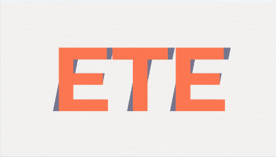

= ETE Project order

== Project description (Projektbezeichnung):

*Full name:* END-TO-END-EVENT-MANAGEMENT +
*Acronym:* ETE

*Logo*

== Project applicant (Projektauftraggeber):
*Company:* FameFox AG +
*Organization:* +
*Department:* personnel department +

=== *Person(s) in charge:*
*Full Name:* Christine D Maldonado +
*Gender:* female +
*Title:* Ms. +
*Tel.:* +43 765 7789-0 +
*E-Mail:* c.maldonado@famefox.com +

=== *Contact details:*
Sternhofweg 11 +
GOPPELSBERG 9771, Austria +
Tel.: +43 732 6794-0 +
Fax: +43 732 6794-89 +
E-Mail: office@famefox.com +

== Project Result (Projektendergebnis):
The main benefit is that it can help you maximize registrations, while minimizing the resources that may otherwise have been needed. If you’re running multiple events, or a regularly occurring event, then this can be particularly useful.

Other features::
- Saves time needed for manual processing
** features like registration
** tracking,
** payment processing
** tools that can aid audience engagement
** money spent
- Aids professionalism and the overall experience
** Prevent overlooking an event+
** the whole process runs more smoothly
- Can help increase engagement
- Supports targeted activity
- A holistic approach
** can act as a hub
** keep everything connected

== Project Scope / goal (Projektziel):
A Java app. Team management and event planning is easier to implement.

== Project Description (Projektbeschreibung):
This project should be able to keep all events sorted on a calendar. +
The following criteria must also be met:

* The overview of the progress of a single result.
* What has been done and what is still in progress.
* Allow other members of the team to see what has been achieved and what has not (e.g. chairs are on loan for the event).

== Meilstone (Projektphasen / Meilensteine):
- Implement basic logic of the code (can create events and save them in a list)
- GUI (Calender)

[options="header"]
|=======================
|Phase                      |Milestone                                              | Due Date
|Execution                  |Implement basic logic of the code                      | n
|Performance  and Control   |Performance, Is GUI Working?, Quality Deliverables     | n
|Project Close              | Project punchlist, reporting                          | n
|=======================

== Start Date (Projektstart):
- 12.12.2020

== Due Date(Projektende):
- End of the school year (07.Juli.2021)

[#_projectresources_projektressourcen]
== Projectresources (Projektressourcen):
- Discord/MS Teams

- IDEA: Intellij

- VC: Github

- Resources from the client:
* Lecture Notes

== Project risk (Projektrisiken):
- Mistakes that results to an unfinished project:
    * Fail to meet the deadline.
    * The incorrect handling of the task.
    * The uneven distribution of tasks.

== Project organisation (Projektorganisation):
Project Leader::
- Sofiane Bounab
Project Team::
- Edina Abazovic, Sebastijan Bogdan, Antonio Grbic

Responsibilities::
- Fulfil the given tasks
** Keep to the schedule
** Make an even distribution of the tasks

- Be able to understand the task and to take responsibility for your mistakes

- Understanding the task and being able to make the right decisions in order to make process.

- Be able to take criticism, in order to be more successful.

- Handing in a well thought solution of the given task.

== (Abschluss des Projektauftrags):
12.12.2020, Unterschrift::
- Bounab Sofiane
- Abazovic Edina
- Grbic Antonio
- Sebastijan Bogdan
